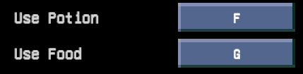

# Bind 4 Consumables

## Unity installation

Clone this repository in your `Asset` folder of your [Core Keeper SDK](https://github.com/Pugstorm/CoreKeeperModSDK).

## Introduction

Mod developped to have a bind to quick use consumables in Core Keeper game.

you can found the mod on the [modIO page](https://mod.io/g/corekeeper/m/bind4consumables).

#### In game footage

- Shortcuts :

- HotbarSlot :

### Heal

Default HotBarSlot = 0 (the rightmost see [HotBarImage](#in-game-footage))
Default Shortcut = F

Prioritize the Greater Heal Potion rather the Heal Potion.
Search in your inventory and move it in the right slot.

### Food

Default HotBarSlot = 9 (on the left of the HealSlot see [HotBarImage](#in-game-footage))
Default Shortcut = G

Search for any cooked or vegetables/fruits food and move it at the right slot.

### Know bug

- Item is not used when it is just moved from the inventory.

### Support

You can support my work at [buymeacoffee.com/gdel35](https://buymeacoffee.com/gdel35)

Star this repo or like the mod on his modIO page ! 